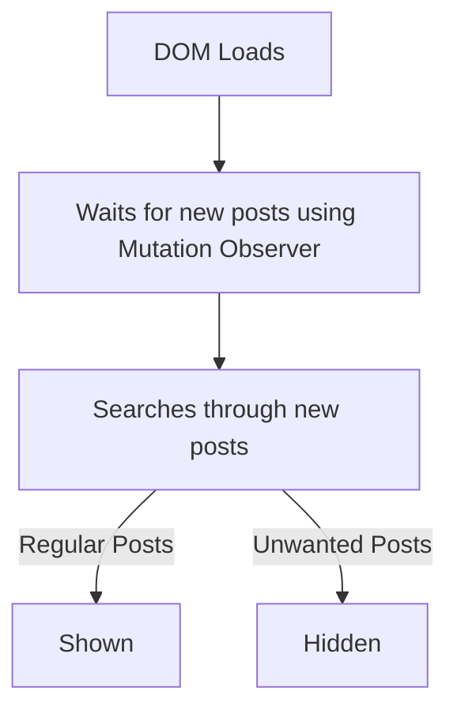

 

    

<h3 align="center">FB Mobile - Clean my feeds (UserScript)</h3>

 

Hides Suggested and Unwanted posts from **Facebook Mobile** feed. Get a clean Newsfeeds with posts only from your friends, pages and groups you follow.

**⚠️ Works on Android Only**

#### Removes:

- Suggested for you
- Sponsored

Facebook has an enhanced Mobile version of facebook which only works on Chromium browsers. The browsing experience is not as good as the App you are used to. It shows low quality photos and videos. But this is all we got that we can inject a script into.

**ℹ️ So keep the original App installed and use it only for leisure browsing.**

#### How it works:

#### Languages Supported:

- English
- বাংলা

_You can contribute by adding more languages_

#### How to use:

1. Find an `Android` phone somewhere.
1. Install [Kiwi Browser](https://play.google.com/store/apps/details?id=com.kiwibrowser.browser) from PlayStore.
   - Facebook enhanced version won't load on Firefox based browsers.
   - Use any Chromium based browser that supports extensions.
1. Launch `Kiwi Browser` then Install the [Violentmonkey](https://chrome.google.com/webstore/detail/violent-monkey/jinjaccalgkegednnccohejagnlnfdag) extension from Chrome Web Store.
   - You can try other similiar extensions but I haven't tried them myself.
1. **(Optional)** Install [uBlock Origin](https://chromewebstore.google.com/detail/ublock-origin/cjpalhdlnbpafiamejdnhcphjbkeiagm) extension.
   - Not required for this script but will improve your overall browsing experience by a mile.
1. Head over to this link and Press `Install` and Confirm installation: [Place link here]
1. Browse https://m.facebook.com/ without the trash.

##### Want to use it like an App?

1. Open https://m.facebook.com/
1. Press the Kiwi Browser `3 dot menu`
1. Press `Add to Homescreen`
1. Set your preferred Label and press `Add`
1. Find it in your Android Home screen

#### Known issues (Must Read)

- Jitters when scrolling
  - You actually scroll faster than you think. So new posts get added pretty frequently. While the execution of the script isn't slow, shrinking of unwanted posts causes constant Page height shifts. You can find learn more about it inside the script.
- Blank Posts when coming back to NewsFeed.
- Firefox based browsers not supported
  - The enhanced version of `m.facebook` only loads on Chromium browsers. Nothing I can do about it for now.
- Api rate limit. **⚠️Please scroll slowly**
  - After a while they keep pushing hundreds of Suggested posts in a row. As you keep scrolling way faster than usual, it is possible to hit Api rate limit.
    `Or in general term: they put a timer between each post requests and you asked for posts before the timer ended`
- Doesn't work when coming back after a break
  - Instead of doing the "Pull down to refresh", press the 3 dot menu and press Refresh there.

⭐ If you like this project a Star would be nice.

⭐ You can request for new filters or submit issues here: [Github/issues](https://github.com/webdevsk/FB-Mobile-Clean-my-feeds/issues)

⭐ Want to contribute? Fork this repo and create a pull request here:
[Github/pulls](https://github.com/webdevsk/FB-Mobile-Clean-my-feeds/pulls)
